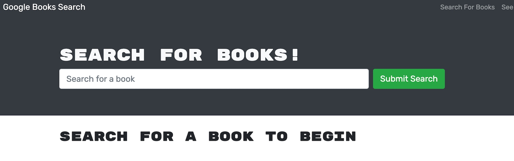

  
  
  # Google Book Search - Homework 21
  ## Description
  Modify a restful API to GraphQl
  
  ## Table of Contents
  - [Installation](#installation)
  - [Usage](#usage)
  - [Contributing](#contributing)
  - [License](#license)
  - [Questions](#questions)
  ## Installation
  npm i
  ## Usage
  npm run develop / npm start

## Testing

none

## Contributing

open source

## License

This project is protected under MIT License.

[License Documentation](https://opensource.org/licenses/MIT)

## Questions

[Refer to Github Profile: tallen1985](http://www.github.com/tallen1985)

Any additional questions, reach me at my email jake.allen@me.com

## Screenshot and Links

[heroku deployed app](https://floating-garden-18801.herokuapp.com/)

[github Repo](https://github.com/tallen1985/21-Homework-MERN)

